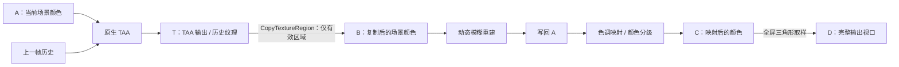

# 实际纹理链与 SR 衔接条件

以下结论来自固定游戏/MHWSS/代理构建的短时运行记录及本地着色器分析。没有执行游戏内 DLSS SR，原始纹理、容器、日志和反汇编不随仓库发布。

## 已记录的颜色流向

资源名称 A/B/C/D/T 是文档中的标记，不是猜测的内存地址。

输入为 1696×954、输出为 2560×1440 的记录中：

| 步骤 | 实测范围 |
|---|---|
| TAA 输出到 B | 源 box `[0,0,0,1696,954,1]`，目标偏移零 |
| 动态模糊重建 | 视口和 scissor 均为 1696×954；顶点 UV 为 0～1，着色器另外使用屏幕/视图常量 |
| 色调映射 | 视口和 scissor 均为 1696×954；四顶点 UV 最大值为 0.662500024 |
| 最终放大 | 视口和 scissor 为 2560×1440；三角形 UV 匹配此前测得的低区域取样 |

这些纹理的**分配尺寸仍为 2560×1440**。在色调映射与最终放大之间，还观察到更新上一帧 GBuffer ID 的计算调用；它不属于上述颜色链。

最终一次比例窗口取得 617 份有效 TAA 输入、365 次匹配放大三角形、10376 次与游戏绑定包匹配的描述符复制，采集丢弃数为零。8 个详细帧包含各 4 个高/低内部尺寸样本，所记录颜色步骤的源目标均连续对应。后来的高档只读窗口也取得相同颜色链。

## 资源识别依据

图形绑定由游戏 `0x259f070` / `0x259f330` 生成，计算绑定由 `0x259f610` 生成。观察器从实际绑定包取得逻辑槽位、资源对象和原 CPU 描述符，再核对 [CopyDescriptorsSimple](https://learn.microsoft.com/en-us/windows/win32/api/d3d12/nf-d3d12-id3d12device-copydescriptorssimple) 的源/目标句柄及实际根表。

复制记录必须属于当前命令列表和同一次管线绑定。计算根表中 UAV 在前、SRV 从偏移 9 开始，不能把 `t0` 等同于表偏移 0，也不能把上一帧复用的描述符误认为当前输入。初版诊断没有这些约束的记录已被后续版本取代，不作为资源对应的依据。

着色器角色来自实际保存的容器，而非仅凭调用次序：

| 角色 | SHA-256 |
|---|---|
| 原生 TAA CS | `2d7b26c742c27db2c83546c6cf6a1dfda47d7cfd4336e69f8c2302de5802b0d1` |
| 动态模糊重建 PS | `3eed9b57bbbdf38d14d9a94596fc93a107aa99eab275af7118b95febbbc1ba18` |
| 色调映射 PS | `174a09e5b23c7e01fb6c47ce86b61250d695113109abb4ffae7219117c31a8cb` |
| 最终复制 PS | `be6127ba48008790fd0e93558b8248cb8acd7c0577899bf50d28e5618ae37b79` |
| 上一帧 GBuffer ID CS | `ee05306030b514dd110ff699a8a1a069b1765f2cb15baecb3639dc762c850f05` |

## 深度：避开原生 TAA 的占位槽

实测原生 TAA 的 `tDepthMap / t2` 是 **1×1、格式 28** 的占位资源。后续模糊重建的 t1 则绑定 2560×1440、格式 41（R32_FLOAT）的深度。其着色器使用投影矩阵系数将采样值转换到另一深度尺度，不能仅凭 R32 格式把它称为线性深度。

进一步定位到 MHWSS 的独立深度准备函数 `0x115940`：它由特定绘制回调或 R32 资源复制回调触发，将真实深度准备到 `RRenderer+0x78` 的 R32 纹理，随后该成员进入上采样资源包。该路径与原生 TAA 的占位槽分开。

运行记录确认，主命令列表上的源正是上述全尺寸 R32 资源，准备纹理也为 2560×1440、R32_FLOAT。270 个高档 TAA 记录中，269 个与该命令列表当前 Reset 代次内较早的深度准备对应；首个中途接入的记录因未见 Reset 不予确认。另一个命令列表也有准备调用，仍须在实际 SR 执行时核对 GPU 顺序、当前输入区域和连续帧深度内容。

## 默认关闭动态模糊

使用者已选择首版 SR 默认关闭动态模糊，并在游戏内将选项保存为 Off。运行观察表明这个选项没有删除重建绘制。四份常量采样一致：

| 参数 | 值 |
|---|---:|
| 采样数量 | 6 |
| 普通快门 | 0 |
| 毛发快门 | 0.4 |
| 模糊阈值 | 1 |

毛发参数非零不等于每个像素都会产生可见模糊，但说明不能把整个步骤直接当作无条件复制。首版 SR 应明确处理这条重建路径，避免完整 SR 输出又被低分辨率绘制覆盖。当前观察器只读取常量，不修改它们。

## 对首版质量档的要求

1. 在实际 TAA 帧范围中使用现代 SR，保留正确深度准备与 MV 解码，不叠加独立 DLAA。
2. SR 成功产出完整纹理后，协调 TAA 后的复制 box；现有 box 只复制左上角低区域。
3. 按默认关闭策略处理动态模糊重建，同时保留颜色结果到色调映射输入的正确流向。
4. 色调映射需要完整输出的视口、scissor 和 UV；只修改最终三角形会遗漏这一处。
5. 协调最后的空间取样，处理失败帧、模式切换、特征释放和原状态恢复。

这些是根据实测确定的接入条件，**尚未实现上述 SR 渲染修改**。当前代理仍使用 native 后端；真正的验证还必须确认使用实际 DLSS 后端，并检查连续帧画质和 GPU 帧时间。

保存日志可用 `tools/summarize_texture_graph.py <capture.jsonl> --output <summary.json>` 离线汇总。角色匹配要求上述着色器哈希，未知变体保持未知。
